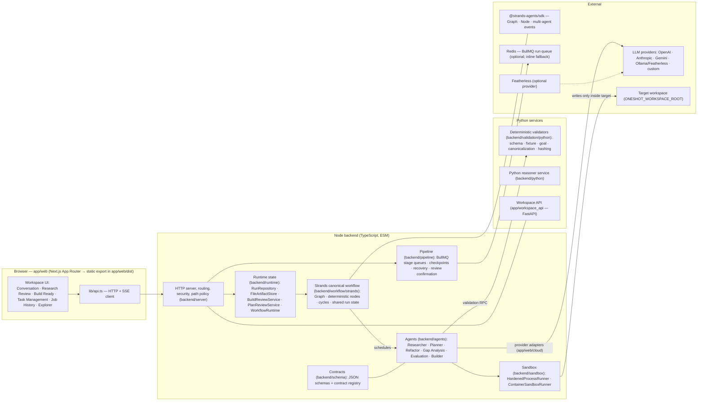
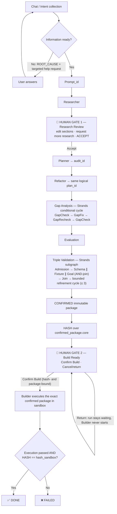
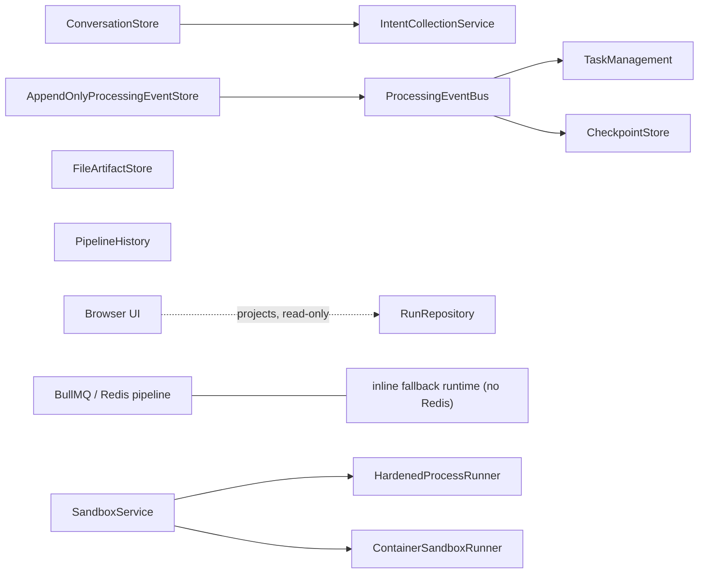
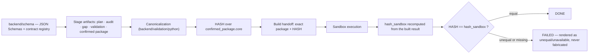
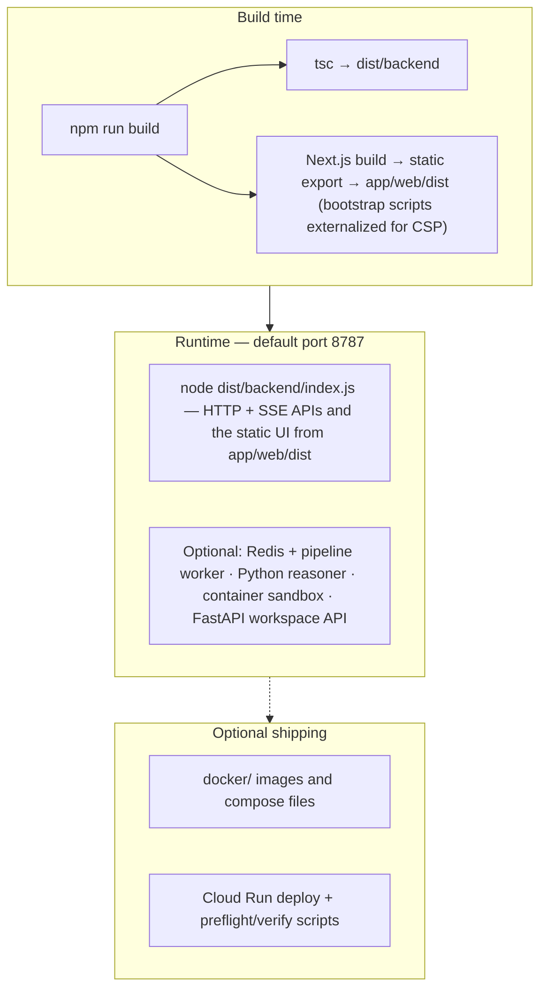

# OneShot Architecture

OneShot is a local-first, human-gated autonomous build pipeline orchestrated
by the [Strands Agents SDK](https://strandsagents.com/) for TypeScript. This
document maps the running system. For the authoritative product behavior,
read the [web app source of truth v3](ONESHOT_WEB_APP_SOURCE_OF_TRUTH_v3.md);
for stage order and artifact ownership, read the
[canonical workflow](CANONICAL_WORKFLOW.md); the ASCII
[workflow tree](WORKFLOW_TREE) mirrors the same flow.

All diagrams are Mermaid and render directly on GitHub.

## 1. System view

Key boundaries:

- The browser consumes and projects real backend records, IDs, events, and
  results. It is never a second workflow store, and missing evidence renders
  as unavailable — never as success.
- Provider credentials stay server-side. The browser submits keys once
  (write-only); secrets are stored outside the repository and never returned
  to the client.
- Sandbox admission checks, workspace path policy, and authentication are
  enforced server-side before any target-workspace access.

## 2. Strands orchestration

The canonical workflow is a real Strands `Graph` from `@strands-agents/sdk`
(`backend/workflow/strands/`). Strands owns node scheduling, lifecycle,
streaming events, and graph traversal; every stage is a deterministic custom
node (`OneShotStageNode extends Node`), so no orchestration stage is an LLM
call by accident.

Strands mechanics used by the port:

- **Deterministic custom nodes** — `OneShotStageNode extends Node`
  (template-method `handle`), mirroring Strands' Agent/AgentNode contract
  without turning validation or planning stages into model calls.
- **Parallel fan-out with AND-join** — Schema, Fixture, and Goal validation
  run concurrently and join at `TripleValidationJoin`.
- **Conditional cycles** — the Gap Analysis ring
  (`GapCheck → GapFix → GapRecheck → GapCheck`) and the validation
  refinement ring use conditional `Edge` handlers and explicit `sources`;
  bounds are enforced in code (256 deterministic gap iterations, 3
  validation refinements, `maxSteps` safety nets).
- **Shared run state** — stage handlers return state deltas applied to a
  typed `WorkflowRunState`; the canonical `oneshot.*` keys are unchanged.

Deterministic guarantees, enforced in code (not by prompt):

- Planner cannot start before Research Review is explicitly accepted, and
  Builder cannot start before Build Ready is explicitly confirmed
  (`wait-build` + `BuildReviewService` rejects stale hash, changed package,
  duplicate approval, and approval after terminal state).
- The confirmation hash covers the canonical comparable representation of
  `confirmed_package.core`; Builder receives that exact package plus hash,
  and post-build verification is a direct equality check, `HASH ==
  hash_sandbox`, computed by the same canonicalization and hashing code.

## 3. Runtime ownership

The backend runtime is authoritative; the browser projects it
([source of truth §4](ONESHOT_WEB_APP_SOURCE_OF_TRUTH_v3.md)).

- `JobId` is a display alias for the existing `run_id`; exactly one run
  identity per run.
- Events are append-only; checkpoints and recovery test scripts cover
  restart and refinement recovery.

## 4. Contracts, validation, and hashing

- Triple Validation is three independent proofs — Schema, Fixture, Goal —
  each returning `VALID | NOT_VALID`; `CONFIRMED` exists only when all
  three are `VALID`.
- Result vocabulary is fixed by contract: workflow operations return
  `PASSED | ROOT_CAUSE`; validation operations return `VALID | NOT_VALID`.

## 5. Deployment view

## 6. Where to read next

| Topic | Document |
| --- | --- |
| Product behavior authority | [ONESHOT_WEB_APP_SOURCE_OF_TRUTH_v3.md](ONESHOT_WEB_APP_SOURCE_OF_TRUTH_v3.md) |
| Stage order, ownership, human gates | [CANONICAL_WORKFLOW.md](CANONICAL_WORKFLOW.md) |
| ASCII workflow tree | [WORKFLOW_TREE](WORKFLOW_TREE) |
| Requirement-to-implementation status | [WEB_APP_REQUIREMENTS_RECONCILIATION.md](WEB_APP_REQUIREMENTS_RECONCILIATION.md) |
| Submission package · demo video kit | [SUBMISSION.md](SUBMISSION.md) · [DEMO_VIDEO_SCRIPT.md](DEMO_VIDEO_SCRIPT.md) |
